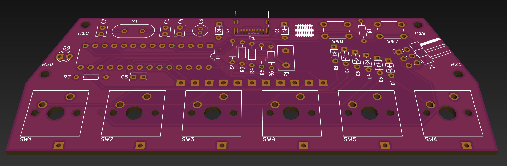
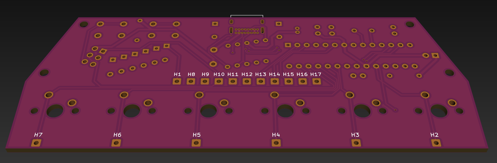

# pin-check

**This is a work in progress for now!**

The pin-check will be a printed circuit board (PCB) for hand-wired keyboards that uses all through-hole components. It is inspired by the [Plaid](https://github.com/hsgw/plaid), [Discipline](https://github.com/coseyfannitutti/discipline), and [Postage Board](https://github.com/LifeIsOnTheWire/Postage-Board/blob/master/README.md). It's called the pin-check becuase pin check is a smaller pattern than plaid and [Gingham](https://yiancar-designs.com/product/gingham/). It will stick up above your case or plate, both to show off the components 😎 and because through-hole components can't fit under the keyswitches on the back side of the PCB like the surface-mounted device (SMD) components of something like Postage Board can.

It might look something like this.

It will use [USBaspLoader](https://github.com/baerwolf/USBaspLoader) as a bootloader.

Eventually this README will include instructions to:

* Design and purchase a plate (probably using [Keyboard Layout Editor](http://www.keyboard-layout-editor.com/), [swillkb](http://builder.swillkb.com/), and [OSH Cut](https://app.oshcut.com/) or another laser cutting service)
* Purchase other case-related things like standoffs and screws
* Get a PCB manufactured (probably using [OSH Park](https://oshpark.com/))
* Purchase the components from the [bill of materials](bom.md)
* Flash USBaspLoader onto the microcontoller unit (MCU), with the PCB mounted on either the left or right side (or the middle 🤷🏻‍♂️) of your keyboard
* Solder the components onto the PCB
* Hand-wire some keyswitches together (need some wire and more diodes for this!) and onto the PCB
* Create a keymap, etc. and flash QMK onto the MCU

Things that are not supported/planned for various reasons:

* Split keyboard support
* LEDs
