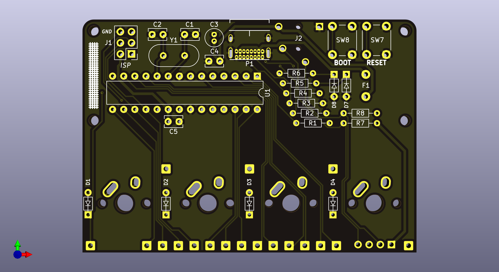
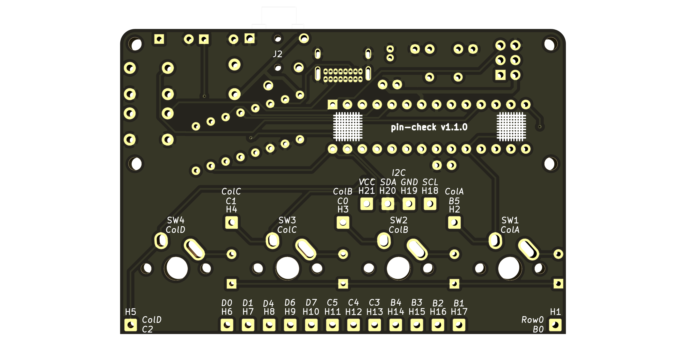

**This is a work in progress for now!**

# Table of Contents

* [Overview](#overview)
* [DIY](#diy)
  * [PCB](#pcb)
  * [Components](#components)
  * [Bootloader](#bootloader)
  * [Acrylic Window](#acrylic-window)
* [Building the Kit](#building-the-kit)
* [Designing a Keyboard](#designing-a-keyboard)
* [QMK](#qmk)
* [Acknowledgments and Sublicenses](#acknowledgments-and-sublicenses)

# Overview
<a name="overview" />

The pin-check is a printed circuit board (PCB) for hand-wired keyboards that uses all through-hole components, and supports [QMK](https://qmk.fm/) and MX or Alps keyswitches. It is inspired by the [Plaid](https://github.com/hsgw/plaid), [Discipline](https://github.com/coseyfannitutti/discipline), and [Postage Board](https://github.com/LifeIsOnTheWire/Postage-Board/blob/master/README.md). It's called the pin-check because pin check is a smaller pattern than plaid and [Gingham](https://yiancar-designs.com/product/gingham/). It will stick up above your case or plate, both to show off the components 😎 and because through-hole components can't fit under the keyswitches on the back side of the PCB like the surface-mounted device (SMD) components of something like Postage Board can.

It looks something like this (before any of the components are added).

[There is a PDF of the schematic here](assets/schematic.pdf).

Kits that include the PCB and all components (except for keyswitches) may be for sale at some point.

# DIY
<a name="diy" />

**If you purchased a kit you can [skip to building the kit](#building-the-kit)!**

## PCB
<a name="pcb" />

To get a PCB, you can submit the files in this repository to any PCB manufacturer. [OSH Park](https://oshpark.com/) lets you upload `.kicad_pcb` files directly, or you can generate Gerber and drill files and submit them to your preferred PCB manufacturer (the manufacturer should have instructions to do this using [KiCad](https://kicad-pcb.org/)).

## Components
<a name="components" />

All of the required electrical components and quantities are listed in the [bill of materials (BOM)](bom.md). You can purchase these components (or equivalent components) from DigiKey, Mouser, or anywhere else you can find them. The BOM does not include parts like keyswitches or keycaps.

## Bootloader
<a name="bootloader" />

To flash new QMK keyboard layouts onto the keyboard (without using an AVR programmer or the ISP pins), the bootloader on the ATmega328P microcontroller unit (MCU) needs to support USB. [USBaspLoader](https://github.com/baerwolf/USBaspLoader) is bootloader for AVR MCUs that uses [V-USB](https://www.obdev.at/products/vusb/index.html) for USB support.

TODO: Add instructions to use avrdude with either an AVR programmer or Raspberry Pi GPIO pins to flash the bootloader onto a fresh chip/MCU.

## Acrylic Window
<a name="acrylic-window" />

If you want to mount a clear acrylic window above the exposed portion of the PCB, you can upload the `assets/window.svg` file in this repository to your preferred laser cutting service or use it to cut a piece of clear acrylic yourself (something around 3mm thick should be good). To mount the window, you need four M2 female-female standoffs that are at least 10 mm long, and eight M2 screws to secure the standoffs to the window and the PCB.

# Building the Kit
<a name="building-the-kit" />

There will be instructions here for assembling the kit (soldering components onto the PCB).

# Designing a Keyboard
<a name="designing-a-keyboard" />

If you already have a plate, case, and keyswitches, and are familiar with hand-wiring, you can [skip to the QMK section](#qmk).

TODO: Add information about limitations of the number of I/O pins on the ATmega328P (and implications for layouts).

TODO: Add example instructions of designing and purchasing a plate (probably using [Keyboard Layout Editor](http://www.keyboard-layout-editor.com/), [swillkb](http://builder.swillkb.com/), and [OSH Cut](https://app.oshcut.com/) or another laser cutting service.

TODO: Add information about standoffs and screws for a sandwich-style case.

TODO: Add information about hand-wiring and required parts (more diodes!).

# QMK
<a name="qmk" />

TODO: Add instructions about creating a keymap in QMK and flashing it onto the keyboard. Mention that H11 and H12 are not available to use for rows or columns if you're setting up a split keyboard!

# Acknowledgments and Sublicenses
<a name="acknowledgments-and-sublicenses" />

* Thank you to [coseyfannitutti](https://github.com/coseyfannitutti) who designed the [Discipline PCB](https://github.com/coseyfannitutti/discipline) for the footprints `D_DO-35_SOD27_P5.08mm_Horizontal.kicad_mod` and `USB_C_GCT_USB4085.kicad_mod`! [The Creative Commons license for these is included here](LICENSE.CFTKB).
* Thanks to [ai03-2725](https://github.com/ai03-2725) for the symbol `MX-NoLED` and footprint `MX-1U-NoLED.kicad_mod` from the [MX_Alps_Hybrid repository](https://github.com/ai03-2725/MX_Alps_Hybrid). The footprint is a slightly modified version (I added F.Mask to the technical layers of pads 1 and 2, so it would show up accurately in Pcbnew's 3D viewer) from [dsanchezseco's pull request](https://github.com/ai03-2725/MX_Alps_Hybrid/pull/15). [The MIT license for these is included here](LICENSE.ai03).
* The symbol `SJ-43514` and footprint `CUI_SJ-43514.kicad_mod` are from [CUI Devices](https://www.cuidevices.com/product/resource/pcbfootprint/sj-43514) (with minor modifications to the footprint to move some weird edge cuts to the Cmts.User layer).
* Lastly, I have to shout out the [plaid PCB](https://github.com/hsgw/plaid) by [hsgw](https://github.com/hsgw) one more time, because it was my first through-hole kit, it inspired me to learn more about circuit and PCB design, and since it's open source it has been a great resource to learn from.
